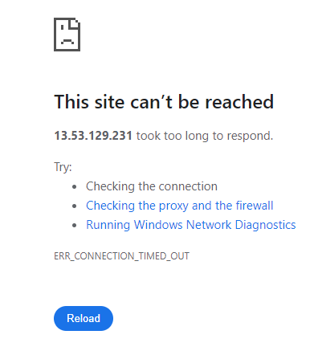
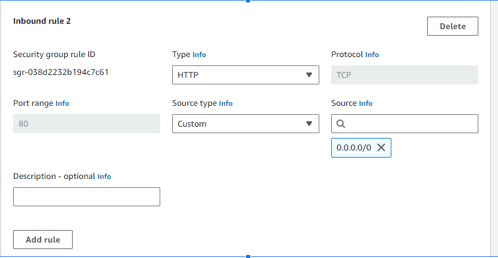

`docker build -t node-dep-example .`

`docker run -d --rm --name node-dep -p 80:80 node-dep-example`

## Deploy image to cloud

Create new repository on docker hub

Make sure that the .pem file does not get on docker hub or github (.dockerignore, .gitignore → *.pem)

Create the image

`docker build -t node-temp-example-1 .
`
The name of the image must be the same as the docker hub repo

`docker tag danielctremura/node-example-1
`
Then to push to dockerhub:

`docker push danielctremura/node-example-1
`

Then on cloud

`docker run -d --rm -p 80:80 danielctremura/node-example-1
`

We you first try to connect to the public ip

Must edit the security group settings/Inbound rules
Add a http rule

Source - who can access. Is set to anyone (0.0.0.0/0)

## Updating the container in the cloud

Re-build the image after a change

`docker build -t node-dep-example-1 .`

Tag it

`docker tag node-dep-example-1 danielctremura/node-example-1`

Push the image

`docker push danielctremura/node-example-1`

On remote, again,

`docker run -d --rm -p 80:80 danielctremura/node-example-1`

Since `docker run` only looks if we have the image, and not if it is the latest version, run 
`docker pull danielctremura/node-example-1`

`docker run` again, and the change will be visible.
