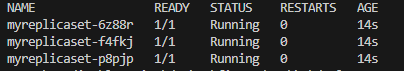
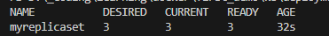

# Pods

`kubectl create -f .\pod.yaml` - create pod
`kubectl apply -f .\pod.yaml` - update pod
`kubectl delete -f .\pod.yaml` - delete pod
`kubectl get pods` - list pods

# Replica sets

`kubectl create -f .\replicaset.yaml` - create

When checking the pods

`kubectl get replicasets`
