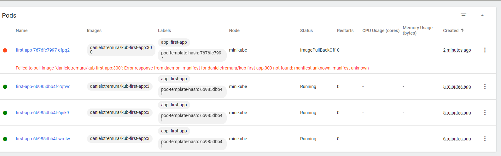
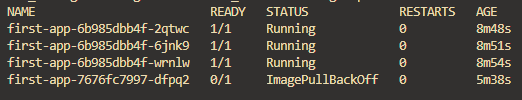

`docker build -t kub-first-app .`
`docker tag kub-first-app danielctremura/kub-first-app`
`docker push danielctremura/kub-first-app`

Send the image to the cluster

`kubectl create deployment first-app --image=danielctremura/kub-first-app`

Check create

`kubectl get deployments`
`kubectl get pods`

Exposing a deployment with a service

`kubectl expose deployment first-app --type=LoadBalancer --port=8080`

Check service

`kubectl get services`

`minikube service first-app` - get the api to reach the docker container

Scalling 

`kubectl scale deployment/first-app --replicas=3`

Updating deployments

- update image

`docker build -t danielctremura/kub-first-app:2 .` - necessary to tag the image, since k8 will
change the code in the browser only if it sees a new version
`docker push danielctremura/kub-first-app:2`

`kubectl set image deployment/first-app kub-first-app=danielctremura/kub-first-app:2`

Deployment rollbacks and history

If you try to add an unexisting docker image to a pod:

`kubectl set image deployment/first-app kub-first-app=danielctremura/kub-first-app:300`

The old pod is not closed until the new one was created. But since the new one
cannot be created:

or `kubectl get pods`

We can roll back the deployment.

`kubectl rollout undo deployment/first-app`

See history:

`kubectl rollout history deployment/first-app`
deployment.apps/first-app 
REVISION  CHANGE-CAUSE    
1         <none>
2         <none>
4         <none>
5         <none>

and to see in detail:
`kubectl rollout history deployment/first-app --revision=2`

deployment.apps/first-app with revision #2
Pod Template:
  Labels:       app=first-app
        pod-template-hash=6dbf8f96fb
  Containers:
   kub-first-app:
    Image:      danielctremura/kub-first-app:2
    Port:       <none>
    Host Port:  <none>
    Environment:        <none>
    Mounts:     <none>
  Volumes:      <none>

`kubectl rollout undo deployment/first-app --to-revision=1` - can rollback to a certain
instance
