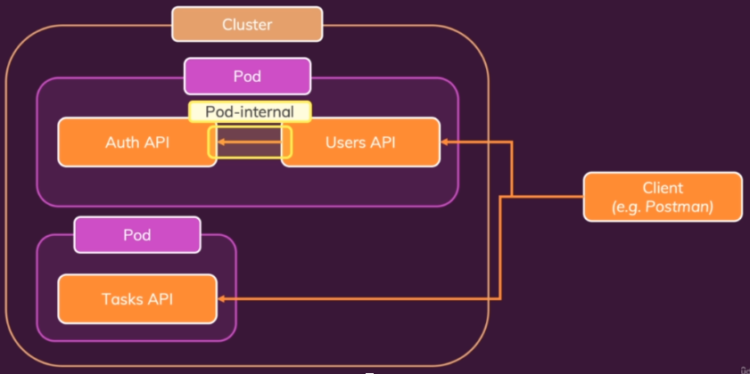
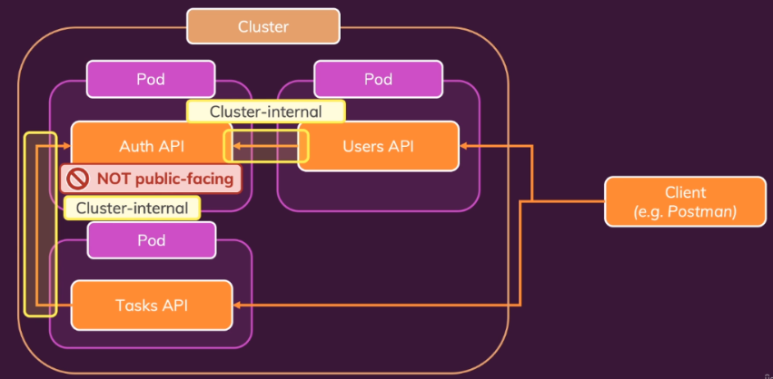
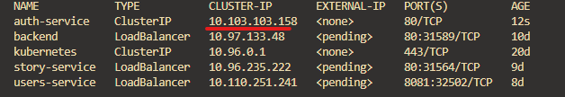
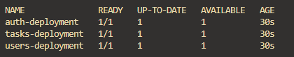
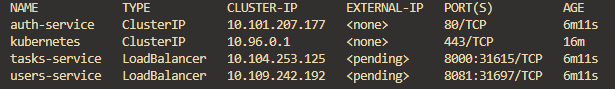

Stage 1

Stage 2

`kubectl get services`
internal IP address - cannot be accessed from the local machine

`kubectl apply -f=auth-deployment.yaml -f=auth-service.yaml -f=users-deployment.yaml -f=users-service.yaml -f=tasks-service.yaml -f=tasks-deployment.yaml`

`kubectl get deployments`

`kubectl get services`

Start task service 

`minikube service tasks-service`

